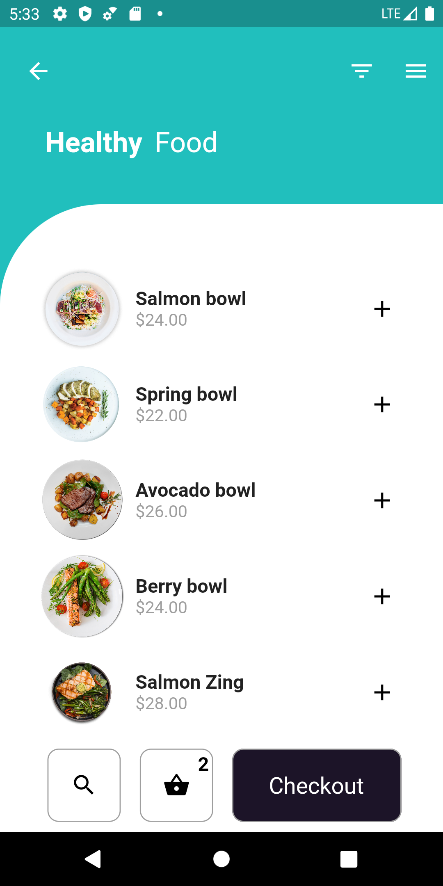

# myapp

A new Flutter project that shows users healthy foods that they could purchase through my app

This app only has a gui and is not connected to a server

## Tutorial

This project was inspired by Raja Yogan

When making this app I followed Raja for the most part and added some customization so I could call it my app

- [Raja Yogan's Github](https://github.com/rajayogan/flutterui-curveddesigns)
- [Raja Yogan's Youtube](https://www.youtube.com/channel/UCjBxAm226XZvgrkO-JyjJgQ)

## Getting Started

First make a directory for which you will be saving the app

Next cd into the directory and copy **git clone https://github.com/Ljtron/flutterTutorial0.git

After the git repository is done downloading start an emulator either android or ios

Lastly in the command line type flutter get, flutter run

A few resources to get you started if this is your first Flutter project:

- [Lab: Write your first Flutter app](https://flutter.dev/docs/get-started/codelab)
- [Cookbook: Useful Flutter samples](https://flutter.dev/docs/cookbook)

For help getting started with Flutter, take a look at
[online documentation](https://flutter.dev/docs), which offers tutorials,
samples, guidance on mobile development, and a full API reference.

## Final product 

### The front page should look like this

### If you click Avocado bowl image or any other image you should be pushed to another screen like this

